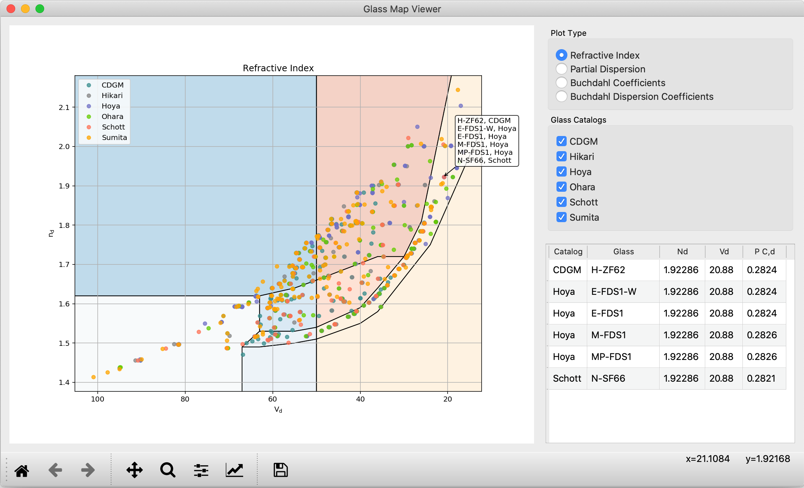
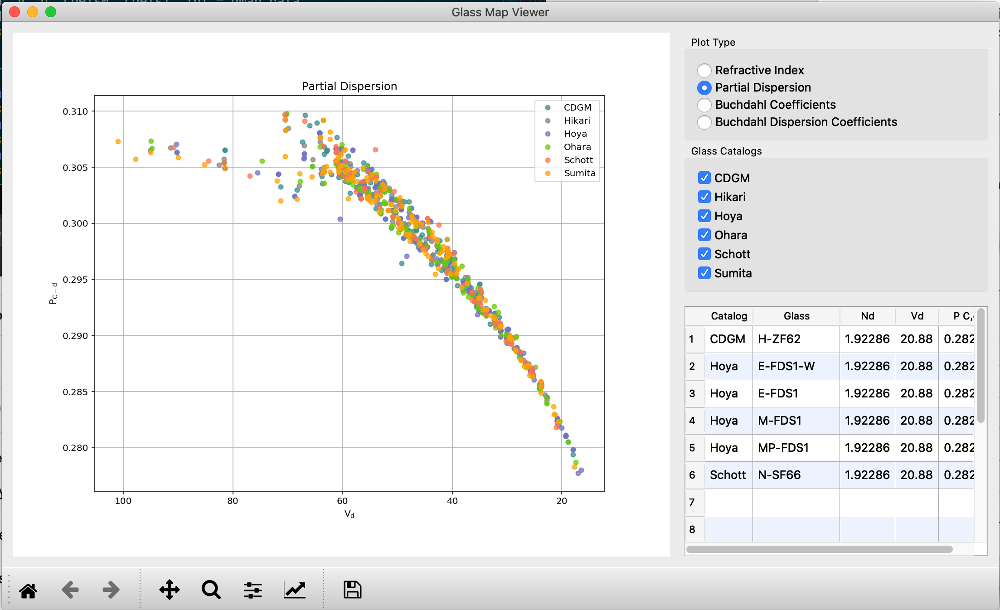
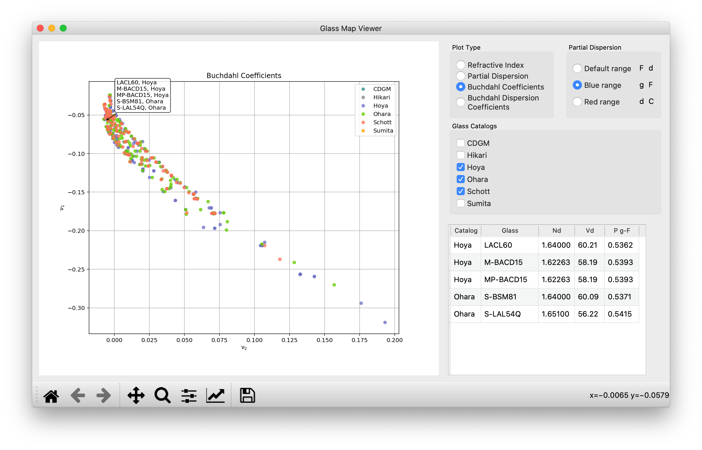
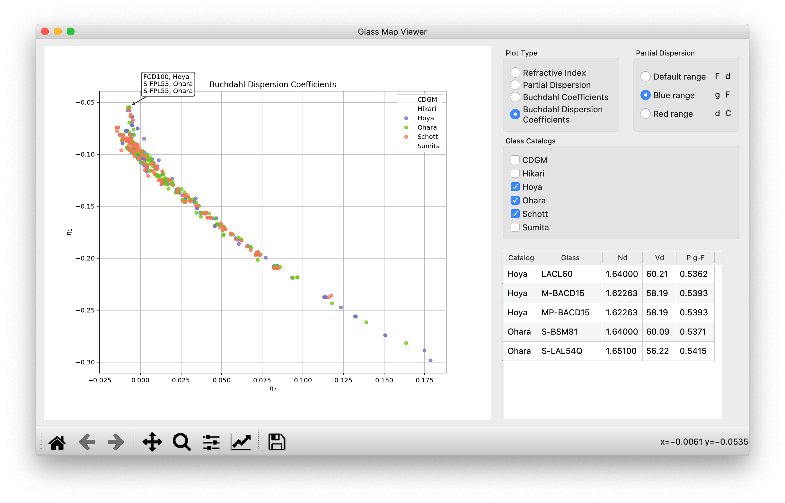

.. currentmodule:: opticalglass

User's Guide
============

OpticalGlass provides a common API for querying refractive index data and other properties to a number of different optical material data sources. These include:

- interfaces to vendor supplied Excel spreadsheets with glass data.
- ability to import material files in the Zemax .agf data format.
- ability to import material data from the RefractiveIndex.INFO database.

These and other sources of data are organized into libraries. Each library contains one or more catalogs, and each catalog contains one or more glasses. The glass catalog of particular vendors (e.g. Hoya, Ohara, Schott) will be found in multiple libraries. The user can control the order in which the libraries are searched, as well as the order of the catalogs available from each library.

The global variable |og_glass_libs| is an instance of the :class:`~.glassfactory.CentralGlassLibrary` class that contains the various libraries and catalogs. 

.. note::

   The spreadsheets containing the glass data are from the vendor websites. The vendors retain all ownership and copyrights to that data.

Installation
------------

To install OpticalGlass using pip, use

.. code::

   > pip install opticalglass

Alternatively, OpticalGlass can be installed from the conda-forge channel using conda

.. code::

   > conda install opticalglass --channel conda-forge

Glass Map Application
---------------------

A desktop application is installed as part of OpticalGlass. It is invoked by running ``glassmap`` at the command line.

.. code::

   > glassmap

On a Windows machine, the ``glassmap`` command will be located in a Scripts directory underneath the install directory. For example, if using a virtual environment named ``optgla``, the command would be

.. code::

   > optgla\Scripts\glassmap

As you hover over the glasses in the map, a pop-up list shows which glasses are under the cursor. Clicking on a glass or glasses in the map will list the glasses and their catalog plus index, V-number and partial dispersion in the table at the right. You can drag glasses from the table and drop the glass, catalog pair on the command line, e.g. as input for the create_glass function.

Partial dispersion data can be displayed by clicking on the plot type in the upper right hand panel. Partials may be displayed for one of several different wavebands by making the choice in the Partial Dispersion box.

Display of different catalogs can be controlled by selecting or unselecting checkboxs in the Glass Catalogs panel on the right.

The Buchdahl Dispersion Coefficient display can be used to find glass pairs that can be corrected at 3 wavelengths. Robb and Mercado showed that glasses lying along the same vector from the origin of the dispersion diagram would be color corrected at 3 wavelegths.

Python Data Model
-----------------

The :mod:`~.glasslibs` module defines the :class:`~.glasslibs.GlassLibrary` class and |GlassCatalogBase| interface. These, along with the interface definition of |OpticalMedium|, provide a common set of interfaces for accessing optical material data from various sources. 

The :class:`~.glasslibs.GlassLibrary` class represents a collection of either glass catalogs or libraries. The collection is iterable, with the iteration order controlled by the :attr:`~.glasslibs.GlassLibrary.search_order` list.  Which items in the collection are "active" can be controlled by setting the :attr:`~.glasslibs.GlassLibrary.active_cltns` property. These settings are used to control the iteration over a library for the :func:`~.glassfactory.create_glass` global function and the methods :meth:`~.glasslibs.GlassLibrary.find_path_to_glass` and :meth:`~.glasslibs.GlassLibrary.find_catalog`.

The :class:`~.glasslibs.GlassCatalog` class is a basic implementation of the |GlassCatalogBase| interface. It is essentially a dict of |OpticalMedium| instances, with the glass name as the key. Each catalog implementation also provides the methods :meth:`~.glasslibs.GlassCatalogBase.create_glass` and  :meth:`~.glasslibs.GlassCatalogBase.glass_map_data`.

Finally, the |OpticalMedium| instances contained in the catalogs provide a common interface for querying refractive index values (:meth:`~.opticalmedium.OpticalMedium.calc_rindex` and :meth:`~.opticalmedium.OpticalMedium.rindex`, among others) and transmission data (:meth:`~.opticalmedium.OpticalMedium.transmission_data`). The wavelength range of the refractive index data is available using the :meth:`~.opticalmedium.OpticalMedium.get_wl_range` method. A specific wavelength can be tested using :meth:`~.opticalmedium.OpticalMedium.within_wl_range`.
