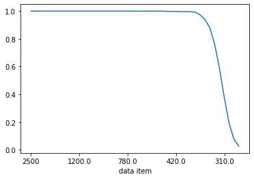
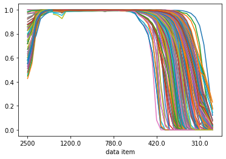
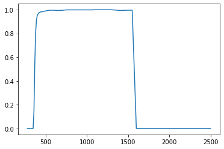

.. currentmodule:: opticalglass

#####################################
Glass Catalog Spreadsheets and Python
#####################################

Optical glass manufacturers have settled on Excel spreadsheets as a means of documenting the technical details of their glass products. The formats are broadly similar but different in the details. 

A major goal of the opticalglass package is to make the data in these vendor spreadsheets accessible to the Python user. opticalglass uses the pandas package to import and save the glass catalog in a |DataFrame|. Common data categories across all vendors include:

    - 'refractive indices'
    - 'dispersion coefficients'
    - 'internal transmission mm, 10'
    - 'chemical properties'
    - 'thermal properties'
    - 'mechanical properties'
    
These queries on the glass catalog dataframe return pandas |Series| with the data and (typically) the wavelengths used for sampling. These can be easily accessed as numpy arrays and can be plotted using matplotlib style capabilities.

The catalogs also contain single items of interest. The 2 that are supported across all catalogs currently include:

    - 'abbe number'
    - 'specific gravity'

A higher level interface is available as a set of catalog-specific subclasses of :class:`~.glass.GlassPandas`.

.. code:: ipython3

    %matplotlib inline

Import glass and catalog factory functions.

.. code:: ipython3

    import numpy as np
    import matplotlib.pyplot as plt
    
    from opticalglass.glassfactory import create_glass, get_glass_catalog

.. code:: ipython3

    catalog = 'Hoya'
    gname = 'FCD1'
    gname1 = 'E-F2'
    gname2 = 'MC-TAF1'

Importing a catalog spreadsheet
-------------------------------

The :func:`~.glassfactory.get_glass_catalog` function is used to read the Excel spreadsheet and populate a |DataFrame| with it. A requirement for the import process is that the spreadsheet data be copied untouched into the catalog |DataFrame|. Only the spreadsheet row and column headers are changed in creating the catalog |DataFrame|.

The :attr:`.GlassCatalogPandas.df` attribute has the glass catalog |DataFrame|.

.. code:: ipython3

    hoya_pd = get_glass_catalog('Hoya')
    hoya_df = hoya_pd.df

The :meth:`~.glass.GlassCatalogPandas.glass_data` method returns a |Series| of the catalog data for the specified glass name.

.. code:: ipython3

    fcd1_pd = hoya_pd.glass_data('FCD1')

Listing a catalog's data categories
-----------------------------------

The column categories can be listed using the get_level_values() method and eliminating duplicates. Categories defined by ``opticalglass`` are all lower case.

.. code:: ipython3

    hoya_df.columns.get_level_values(0).drop_duplicates()

.. parsed-literal::

    Index([                                                                  'Code',
                                                                 'refractive index',
                                                                      'abbe number',
                                                               'refractive indices',
                                                                            'blank',
                                                          'dispersion coefficients',
                                                              'Partial Dispersions',
                                                        'Partial Dispersion Ratio ',
                                        'Deviation of Relative Partial Dispersions',
                                                              'chemical properties',
                                                               'thermal properties',
                                                            'mechanical properties',
                                      'Temperature Coefficient of Refractive Index',
                                                                                nan,
              'Temperature Coefficient of Refractive Index  nh  404.66   (×10-6/℃)',
              'Temperature Coefficient of Refractive Index  ng  435.84   (×10-6/℃)',
              'Temperature Coefficient of Refractive Index  nF' 479.99   (×10-6/℃)',
              'Temperature Coefficient of Refractive Index  nF  486.13   (×10-6/℃)',
              'Temperature Coefficient of Refractive Index  ne  546.07   (×10-6/℃)',
              'Temperature Coefficient of Refractive Index  nd  587.56   (×10-6/℃)',
           'Temperature Coefficient of Refractive Index  nHe-Ne  632.8   (×10-6/℃)',
              'Temperature Coefficient of Refractive Index  nC' 643.85   (×10-6/℃)',
              'Temperature Coefficient of Refractive Index  nC  656.27   (×10-6/℃)',
               'Temperature Coefficient of Refractive Index  nr 706.52   (×10-6/℃)',
                'Temperature Coefficient of Abbe number  dνd/dT 587.56   (×10-3/℃)',
                'Temperature Coefficient of Abbe number  dνe/dT 546.07   (×10-3/℃)',
                                 'Refractive index change to the cooling velocity ',
                                                      'Stress Optical Coefficient ',
                                                                 'specific gravity',
                                                          'Spectral Transmittance ',
                                                     'internal transmission mm, 10',
                                                      'Glass Cross Reference Index',
                                                                          'Remarks',
                                                                           'Update'],
          dtype='object', name='category')

The standard data categories can then be used to access the specific glass's data.

The ``'dispersion coefficients'`` category give the glass's dispersion polynomial coefficients.

.. code:: ipython3

    fcd1_pd['dispersion coefficients']

.. parsed-literal::

    data item
    A0       2.218113
    A0pow           0
    A1      -5.799427
    A1pow          -3
    A2       8.347068
    A2pow          -3
    A3       6.504652
    A3pow          -5
    A4       8.514219
    A4pow          -6
    A5      -5.885227
    A5pow          -7
    Name: FCD1, dtype: object

The ``'refractive indices'`` category gives the measured refractive indices at measurement wavelengths.

.. code:: ipython3

    fcd1_pd['refractive indices']

.. parsed-literal::

    data item
    1529.6     1.48598
    1128.64    1.48907
    t          1.49008
    s          1.49182
    A'           1.493
    r          1.49408
    C          1.49514
    C'         1.49543
    He-Ne      1.49571
    D          1.49694
    d            1.497
    e          1.49845
    F          1.50123
    F'         1.50157
    g          1.50451
    h          1.50721
    i          1.51175
    Name: FCD1, dtype: object

The refractive index at a particular spectral line can be obtained with an additional level of indexing.

.. code:: ipython3

    fcd1_pd['refractive indices']["F'"]

.. parsed-literal::

    1.50157

Data can be returned in numpy arrays using the pandas conversion function :meth:`~pandas.Series.to_numpy`

.. code:: ipython3

    indices = fcd1_pd['refractive indices'].to_numpy(dtype=float); indices

.. parsed-literal::

    array([1.48598, 1.48907, 1.49008, 1.49182, 1.493  , 1.49408, 1.49514,
           1.49543, 1.49571, 1.49694, 1.497  , 1.49845, 1.50123, 1.50157,
           1.50451, 1.50721, 1.51175])

Transmission data for 10mm thick samples is available.

.. code:: ipython3

    fcd1_pd['internal transmission mm, 10']

.. parsed-literal::

    data item
    2500      0.999
    2400.0    0.999
    2200.0    0.999
    2000.0    0.999
    1800.0    0.999
    1600.0    0.999
    1550.0    0.999
    1500.0    0.999
    1400.0    0.999
    1300.0    0.999
    1200.0    0.999
    1100      0.999
    1060.0    0.999
    1050.0    0.999
    1000.0    0.999
    950.0     0.999
    900.0     0.999
    850.0     0.999
    830.0     0.999
    800.0     0.999
    780.0     0.999
    750.0     0.999
    700       0.999
    650.0     0.998
    600.0     0.999
    550.0     0.999
    500.0     0.999
    480.0     0.999
    460.0     0.997
    440.0     0.997
    420.0     0.997
    400.0     0.995
    390.0     0.996
    380       0.995
    370.0      0.99
    360.0     0.972
    350.0     0.939
    340.0     0.878
    330.0     0.761
    320.0     0.586
    310.0     0.376
    300.0      0.19
    290.0     0.077
    280.0     0.027
    Name: FCD1, dtype: object

The transmission data may be plotted directly from the |Series| via :meth:`~pandas.Series.plot`

.. code:: ipython3

    fcd1_pd['internal transmission mm, 10'].T.plot()

.. parsed-literal::

    <AxesSubplot:xlabel='data item'>

All of the glasses in the catalog |DataFrame| may be plotted on the same graph.

.. code:: ipython3

    hoya_df['internal transmission mm, 10'].T.plot(legend=False)

.. parsed-literal::

    <AxesSubplot:xlabel='data item'>

Transmission data for a list of glasses can be plotted as well.

.. code:: ipython3

    hoya_df.loc[['FCD1', 'E-F2']]['internal transmission mm, 10'].T.plot()

.. parsed-literal::

    <AxesSubplot:xlabel='data item'>

.. image:: output_26_1.png

OpticalMedium subclasses
------------------------

The glass data |Series| gives access to all of the vendor's glass data, but doesn't address the important case of using the dispersion coefficients to calculate the refractive index at an arbitrary wavelength. This is provided by catalog-specific subclasses of :class:`~.opticalmedium.OpticalMedium`. 

.. code:: ipython3

    fcd1 = create_glass('FCD1', 'Hoya')
    ef2 = create_glass('E-F2', 'Hoya')

Compare measured values vs. the dispersion equation
---------------------------------------------------

Get the measured wavelengths. These are the indices of the ``'refractive indices'`` category

.. code:: ipython3

    wvls = fcd1.glass_data()['refractive indices'].index; wvls

.. parsed-literal::

    Index([ 1529.6, 1128.64,     't',     's',    'A'',     'r',     'C',    'C'',
           'He-Ne',     'D',     'd',     'e',     'F',    'F'',     'g',     'h',
               'i'],
          dtype='object', name='data item')

The :meth:`~.opticalmedium.OpticalMedium.meas_rindex` method queries the refractive indices at the catalog wavelengths (the indices of the 'refractive indices' category).

The :meth:`~.opticalmedium.OpticalMedium.rindex` method uses the 'dispersion coefficients' to calculate the refractive index at the specified wavelength.

The following produces a table comparing the measured values to the output from the dispersion equation.

.. code:: ipython3

    print(" wvl     meas n   interp n    delta")
    for w_str in wvls:
        n_line = fcd1.meas_rindex(w_str)
        try:
            n_intrp = fcd1.rindex(w_str)
        except KeyError:
            print(f'{w_str}: {n_line}, Key error')
        else:
            print(f'{str(w_str):7s} {n_line:8.5f}  {n_intrp:8.5f}  {n_intrp-n_line:8.2g}')

.. parsed-literal::

     wvl     meas n   interp n    delta
    1529.6   1.48598   1.48598    -4e-06
    1128.64  1.48907   1.48907  -2.4e-06
    t        1.49008   1.49008    -2e-07
    s        1.49182   1.49182   4.9e-06
    A'       1.49300   1.49300   3.3e-06
    r        1.49408   1.49408  -4.9e-06
    C        1.49514   1.49514  -2.5e-06
    C'       1.49543   1.49543   4.1e-06
    He-Ne    1.49571   1.49571   9.4e-07
    D        1.49694   1.49694   2.9e-06
    d        1.49700   1.49700  -2.8e-06
    e        1.49845   1.49845   4.7e-07
    F        1.50123   1.50123  -2.5e-06
    F'       1.50157   1.50157   2.4e-06
    g        1.50451   1.50451  -8.7e-07
    h        1.50721   1.50721   1.2e-06
    i        1.51175   1.51175  -6.4e-07

An alternative way to create an glass object 
--------------------------------------------

Call create_glass() on the glass catalog itself.

.. code:: ipython3

    fcd1_v2 = hoya_pd.create_glass('FCD1', 'Hoya')

.. code:: ipython3

    fcd1_v2.meas_rindex('F')

.. parsed-literal::

    1.50123

.. code:: ipython3

    fcd1_v2.glass_code()

.. parsed-literal::

    '497.816'

Plotting transmission data
--------------------------

The :meth:`~.glass.GlassPandas.transmission_data` method returns the material transmission data for a 10mm thick sample, as well as the sample wavelengths. The data may be passed directly into matplotlib plot routines.

.. code:: ipython3

    plt.plot(*ef2.transmission_data())

.. parsed-literal::

    [<matplotlib.lines.Line2D at 0x7f9148fcfac0>]

