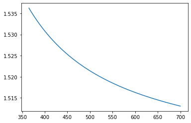
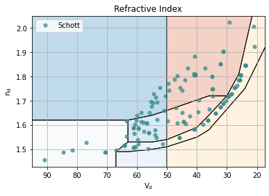
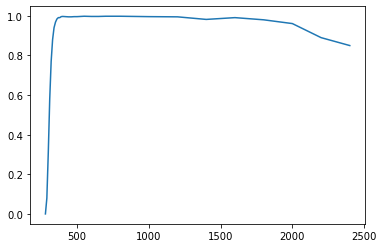

.. currentmodule:: opticalglass

########################
Command Line Quick Start
########################

.. code:: ipython3

    import numpy as np

.. code:: ipython3

    import pandas as pd

.. code:: ipython3

    import matplotlib.pyplot as plt

.. code:: ipython3

    import opticalglass as og
    import opticalglass.glassmap as gm
    from opticalglass.glassfactory import create_glass

Creating a Glass Object
-----------------------

You create a glass object using the :func:`~.glassfactory.create_glass` function.
The glass name and catalog name are the arguments.

.. code:: ipython3

    bk7 = create_glass('N-BK7', 'Schott')
    print(bk7)

.. parsed-literal::

    Schott N-BK7: 517.642

.. code:: ipython3

    bk7.glass_code()

.. parsed-literal::

    '517.642'

Getting refractive index data
-----------------------------

Use the :meth:`~.glass.GlassPandas.rindex` method of the glass object to get the refractive index at the input wavelength. The wavelength input can either be a numeric value in nanometers or a spectral line character string.

.. code:: ipython3

    nd = bk7.rindex('d')
    nF = bk7.rindex('F')
    nC = bk7.rindex('C')
    nC, nd, nF

.. parsed-literal::

    (1.5143223472613747, 1.5168000345005885, 1.5223762897312285)

Defining a user-defined Glass object
------------------------------------

It is also possible to work with a user-defined Glass object. There are several types of Glass objects available. 
One particularly useful class is :class:`~.opticalmedium.InterpolatedMedium`, which creates a glass object by interpolating between a finite number of (wavelength, refractive index) data points.

For example, 'BD-2' is an infrared glass material whose refractive index is `tabulated <https://refractiveindex.info/download/data/2013/BD-2.pdf>`__ by the manufacturer.
To create a Glass object,

.. code:: ipython3

  from opticalglass import opticalmedium as om

  # A list of ([wavelength in nm], [refractive index]) pairs
  pairs = [
    (3000, 2.6266), (4000, 2.6210), (5000, 2.6173), (6000, 2.6142), (7000, 2.6117),
    (8000, 2.6088), (9000, 2.6055), (10000, 2.6023), (11000, 2.5983), (12000, 2.5942),
    (13000, 2.5892), (14000, 2.5843)
  ]
  # user-defined glass object
  glass = om.InterpolatedMedium('BD2', pairs=pairs, cat='LIGHTPATH')

  # Then, this can be used as the same way to the predefined glass object
  glass.rindex(2500)

.. parsed-literal::
  array(2.6306544)

We can also *register* this user-defined glass by :func:`~.glassfactory.register_glass`

.. code:: ipython3

  from opticalglass.glassfactory import register_glass
  register_glass(glass)

Now, we can access to the glass from the name (`BD2`) and catalog (`LIGHTPATH`)

.. code:: ipython3

  create_glass('BD2', 'LIGHTPATH')

.. parsed-literal::

  InterpolatedMedium('BD2', cat='LIGHTPATH', wvls=[3000, 4000, ..., 14000], rndx=[2.6266, 2.621, ..., 2.5843], kvals_wvls=None, kvals=None)

V-number and Partial Dispersion
-------------------------------

Use the :func:`~.util.calc_glass_constants` function to calculate the optical constants given 3 refractive indices. The function accepts vector (NumPy) inputs as well, producing vector outputs. 

.. code:: ipython3

    vd, PCd = og.util.calc_glass_constants(nd, nF, nC)
    nd, vd, PCd

.. parsed-literal::

    (1.5168000345005885, 64.1673362374998, 0.6923634296510195)

.. code:: ipython3

    dFC = nF-nC
    vd = (nd - 1.0)/dFC
    PCd = (nd-nC)/dFC
    nd, vd, PCd

.. parsed-literal::

    (1.5168000345005885, 64.1673362374998, 0.30763657034898056)

.. code:: ipython3

    bk7.rindex(555.0)

.. parsed-literal::

    1.5182740250316704

Plot Refractive Index vs Wavelength
-----------------------------------

You can get all of the refractive indices for a NumPy array of wavelengths using the :meth:`~.glass.GlassPandas.calc_rindex` method of the glass object. This is (potentially) faster than using a loop over wavelengths and :meth:`~.glass.GlassPandas.rindex`.

.. code:: ipython3

    wl = np.linspace(365., 700., num=75)
    rn = bk7.calc_rindex(wl)
    plt.plot(wl,rn)

.. parsed-literal::

    [<matplotlib.lines.Line2D at 0x7fbf18ad80d0>]

.. code:: ipython3

    wl=[]
    rn=[]
    for i in np.linspace(365., 700., num=75):
         wl.append(i)
         rn.append(bk7.rindex(i))
    plt.plot(wl,rn)

.. parsed-literal::

    [<matplotlib.lines.Line2D at 0x7fbf2860bd60>]

Display a Glass Map
-------------------

The default display is index vs V-number. Other display options are available in the :class:`~.glassmap.GlassMapFigure` class.

The data plotted is controlled by :class:`~.glassmap.GlassMapDB`,the glass_db list. The default list includes all of the supported commercial catalogs. Additional lists of glasses can be added to the display.

.. code:: ipython3

    gmf = plt.figure(FigureClass=gm.GlassMapFigure,
                     glass_db=gm.GlassMapDB()).plot()

Drag and Drop to the Command Line
---------------------------------

The create_glass function accepts a glass that has been "dragged" from the glassmap python app. The string below is what gets dropped into the command line. 

.. code:: ipython3

    sbsl7 = create_glass("S-BSL 7,Ohara")

.. code:: ipython3

    print(sbsl7)

.. parsed-literal::

    Ohara S-BSL 7: 516.641

.. code:: ipython3

    sbsl7.rindex('F')

.. parsed-literal::

    1.5219049400380837

.. code:: ipython3

    og.glass.decode_glass_name(sbsl7.name())

.. parsed-literal::

    (('BSL', '7'), 'S', '')

Glass Transmission Data
-----------------------

Get the raw transmission data from the catalog spreadsheet by using the :meth:`~.glass.GlassPandas.transmission_data` method of the glass.

This returns the transmission data for a 10mm sample thickness.

A list of (wavelength (nm), transmittance) pairs is returned.

.. code:: ipython3

    t_data = sbsl7.transmission_data()

Plot Transmission vs Wavelength
-------------------------------

.. code:: ipython3

    plt.plot(*t_data)

.. parsed-literal::

    [<matplotlib.lines.Line2D at 0x7fbf18d08040>]

