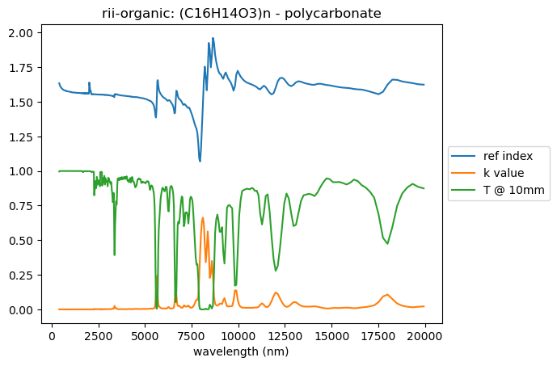
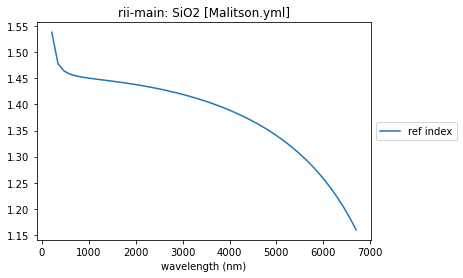
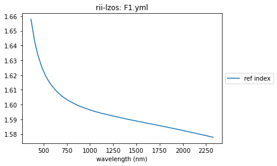
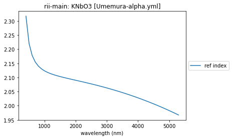

.. currentmodule:: opticalglass

##############################
RefractiveIndex.Info interface
##############################

Access to the `RefractiveIndex.INFO <https://refractiveindex.info>`_ database is provided by the :mod:`~.rindexinfo` module. A major function of this module is to create glass instances (:class:`~.rindexinfo.RIIMedium` or :class:`~.opticalmedium.InterpolatedMedium`) for use in optical models.

.. code:: ipython3

    from opticalglass.glassfactory import create_glass
    from opticalglass.rindexinfo import summary_plots

Typical use scenario - Polycarbonate
====================================

Ofttimes, a Google search of a "refractive index for Polycarbonate" will include a RefractiveIndex.Info link in the query. 
Follow the link to the page on `RefractiveIndex.INFO <https://refractiveindex.info>`_ for Polycarbonate.

.. image:: RII_page_top.png
   :align: center

----

The data is below this on the web page.

.. image:: RII_page_rindexdata.png
   :align: center

----

To get a link to the data for this material, scroll further down the webpage to the Data section:

.. image:: RII_page_data_links.png
   :align: center

----

Right mouse click on the ``Full database record`` link and choose the ``Copy Link Address`` menu item:

.. image:: RII_page_copy_data_link.png
   :align: center

----

We can now define a variable for the polycarbonate data url and paste the link we obtained above into the right hand side of the definition.

.. code:: ipython3

    polycarb_url = 'https://refractiveindex.info/database/data-nk/organic/(C16H14O3)n%20-%20polycarbonate/Zhang.yml'

The function :func:`~.glassfactory.create_glass` takes the URL of the material in the and the names and returns a glass instance.

.. code:: ipython3

    polycarb = create_glass(polycarb_url, "rindexinfo")

The :func:`~.rindexinfo.summary_plots` function can be used in a scripting environment to plot the (complex) refractive index data of a material.

.. code:: ipython3

    summary_plots(polycarb)

.. parsed-literal::

    ['tabulated nk']

There is additional information available for each database entry, beyond refractive index and absorption. It is easiest to work directly with the imported yaml data. The `rindexinfo` materials returned from create_glass() all have a `yaml_data` attribute, i.e. the complete database record.

.. code:: ipython3

    polycarb.yaml_data.keys()

.. parsed-literal::

    dict_keys(['REFERENCES', 'COMMENTS', 'DATA', 'SPECS'])

The 'DATA' key contains the raw index data. The 'REFERENCES' key is always present and documents the source of the data.

.. code:: ipython3

    polycarb.yaml_data['REFERENCES']

.. parsed-literal::

    '1) X. Zhang, J. Qiu, X. Li, J. Zhao, L. Liu. Complex refractive indices measurements of polymers in visible and near-infrared bands, <a href="https://doi.org/10.1364/AO.383831"><i>Appl. Opt.</i> <b>59</b>, 2337-2344 (2020)</a> (0.4-2 µm) 2) X. Zhang, J. Qiu, J. Zhao, X. Li, L. Liu. Complex refractive indices measurements of polymers in infrared bands, <a href="https://doi.org/10.1016/j.jqsrt.2020.107063"><i>J. Quant. Spectrosc. Radiat. Transf.</i> <b>252</b>, 107063 (2020)</a> (2-20 µm)'

The 'COMMENTS' key is often present with additional information. The 'SPECS' is a catch-all dictionary of additional data.

.. code:: ipython3

    polycarb.yaml_data['COMMENTS']

.. parsed-literal::

    'Normal temperature and pressure. Manufacturer: Dedicated Plastic, China.'

.. code:: ipython3

    polycarb.yaml_data['SPECS']

.. parsed-literal::

    {'n_is_absolute': True, 'wavelength_is_vacuum': False}

Material file examples
======================

Below are a sampling of different material files of common interest.

SiO2
----

.. code:: ipython3

    sio2_url = 'https://refractiveindex.info/database/data-nk/main/SiO2/Malitson.yml'
    sio2 = create_glass(sio2_url, "rindexinfo")
    summary_plots(sio2)

.. parsed-literal::

    ['formula 1']

CaF2
----

.. code:: ipython3

    caf2_url = 'https://refractiveindex.info/database/data-nk/main/CaF2/Daimon-20.yml'
    caf2 = create_glass(caf2_url, "rindexinfo")
    summary_plots(caf2)

.. parsed-literal::

    ['formula 2']

.. image:: output_19_1.png

Germanium
---------

.. code:: ipython3

    ge_url = 'https://refractiveindex.info/database/data-nk/main/Ge/Amotchkina.yml'
    ge = create_glass(ge_url, "rindexinfo")
    summary_plots(ge)

.. parsed-literal::

    ['tabulated nk']

.. image:: output_21_1.png

PEDOT
-----

.. code:: ipython3

    pedot_url = 'https://refractiveindex.info/database/data-nk/other/mixed%20organic/PEDOT-PSS/Chen.yml'
    pedot = create_glass(pedot_url, "rindexinfo")
    summary_plots(pedot)

.. parsed-literal::

    ['tabulated n', 'tabulated k']

.. image:: output_23_1.png

F1 LZOS
-------

.. code:: ipython3

    url = 'https://refractiveindex.info/database/data-nk/glass/lzos/F1.yml'
    F1 = create_glass(url, "rindexinfo")
    summary_plots(F1)

.. parsed-literal::

    ['tabulated n']

MgF2
----

.. code:: ipython3

    url_root = 'https://refractiveindex.info/database/data-nk/'

.. code:: ipython3

    url = url_root + 'main/MgF2/Li-e.yml'

.. code:: ipython3

    MgF2 = create_glass(url, "rindexinfo")
    summary_plots(MgF2)

.. parsed-literal::

    ['formula 1']

.. image:: output_29_1.png

KNbO3
-----

.. code:: ipython3

    url = url_root + 'main/KNbO3/Umemura-alpha.yml'

.. code:: ipython3

    KNbO3 = create_glass(url, "rindexinfo")
    summary_plots(KNbO3)

.. parsed-literal::

    ['formula 4']

.. code:: ipython3

    KNbO3.data_range

.. parsed-literal::

    array([0.4, 5.3])

.. code:: ipython3

    KNbO3.yaml_data

.. parsed-literal::

    {'REFERENCES': 'N. Umemura, K. Yoshida, and K. Kato. Phase-matching properties of KNbO3 in the mid-infrared, <a href="    https://doi.org/10.1364/AO.38.000991"><i>Appl Opt.</i> <b>38</b>, 991-994 (1999)</a>',
     'COMMENTS': 'nα; 22 °C.',
     'DATA': [{'type': 'formula 4',
       'wavelength_range': '0.40 5.3',
       'coefficients': '4.4222 0.09972 0 0.05496 1 0 0 0 1 -0.01976 2'}]}

.. code:: ipython3

    KNbO3.coefs

.. parsed-literal::

    array([ 4.4222 ,  0.09972,  0.     ,  0.05496,  1.     ,  0.     ,
            0.     ,  0.     ,  1.     , -0.01976,  2.     ])

.. code:: ipython3

    len(KNbO3.coefs)

.. parsed-literal::

    11

