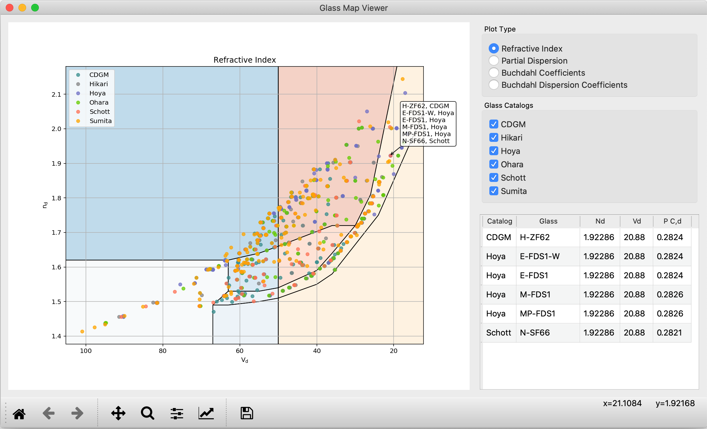
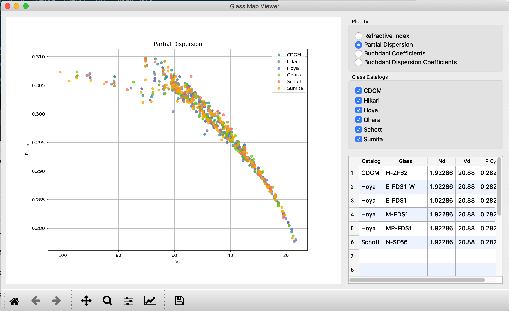
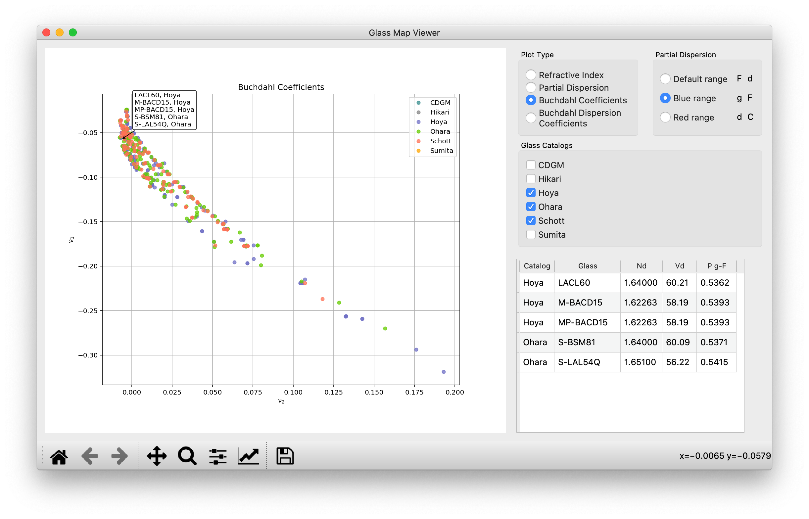
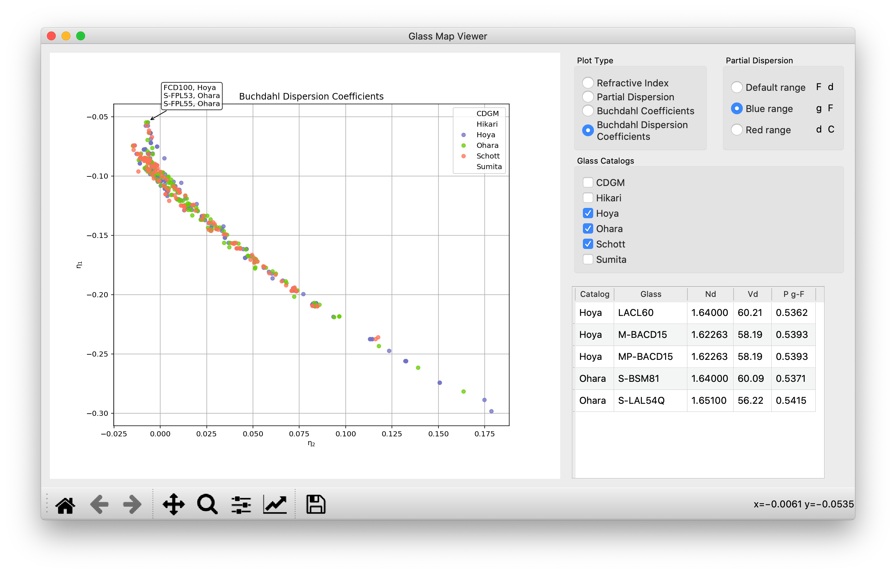

.. currentmodule:: opticalglass

User's Guide
============

Optical glass manufacturers provide detailed technical data for optical glasses via Excel spreadsheets. The :mod:`opticalglass` package provides uniform access to data from different vendors.

.. note::

   The spreadsheets containing the glass data are from the vendor websites. The vendors retain all ownership and copyrights to that data.

Installation
------------

To install :mod:`opticalglass` using pip, use

.. code::

   > pip install opticalglass

Alternatively, :mod:`opticalglass` can be installed from the conda-forge channel using conda

.. code::

   > conda install opticalglass --channel conda-forge

Glass Map Application
---------------------

A desktop application is installed as part of :mod:`opticalglass`. It is invoked by running ``glassmap`` at the command line.

.. code::

   > glassmap

On a Windows machine, the ``glassmap`` command will be located in a Scripts directory underneath the install directory. For example, if using a virtual environment named ``optgla``, the command would be

.. code::

   > optgla\Scripts\glassmap

As you hover over the glasses in the map, a pop-up list shows which glasses are under the cursor. Clicking on a glass or glasses in the map will list the glasses and their catalog plus index, V-number and partial dispersion in the table at the right. You can drag glasses from the table and drop the glass, catalog pair on the command line, e.g. as input for the create_glass function.

Partial dispersion data can be displayed by clicking on the plot type in the upper right hand panel.

Display of different catalogs can be controlled by selecting or unselecting checkboxs in the Glass Catalogs panel on the right.

The Buchdahl Dispersion Coefficient display can be used to find glass pairs that can be corrected at 3 wavelengths. Robb and Mercado showed that glasses lying along the same vector from the origin of the dispersion diagram would be color corrrected at 3 wavelegths.

Python Data Model
-----------------

Two families of objects are provided to manage access to glass data. The :class:`~.glass.GlassCatalogSpreadsheet` base class manages the generic operations on the catalog. Subclasses of :class:`~.glass.GlassCatalogSpreadsheet` provide specific mapping information for the vendor spreadsheet format. The :class:`~.glass.Glass` base class manages the generic operations on the individual glass instances, principally the index interpolation function :func:`~.glass.Glass.calc_rindex`.

A factory interface to :class:`~.glass.Glass` creation is the function :func:`~.glassfactory.create_glass` that returns a :class:`~.glass.Glass` instance of the appropriate catalog type, given the glass and catalog names.

A Glass Map display can be created using the :mod:`~.glassmap` module. Lists of glasses as well as catalog names can be used to populate the map, using the :class:`~.glassmap.GlassMapDB` class. That is used as input to the :class:`~.glassmap.GlassMapFigure` class that creates the glass map plot.
