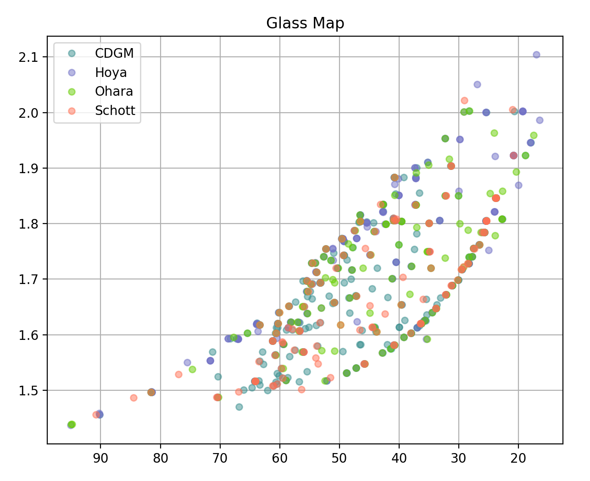

opticalglass
============

:mod:`opticalglass` is a Python package to interface with optical glass manufacturers glass data spreadsheets. It provides a neutral API to query data from multiple catalogs. A Qt-based graphical glass map display is built on top of this capability.

.. toctree::
   :maxdepth: 2

   README

   OG_Quickstart/OG_Quickstart

   opticalglass

Indices and tables
==================

* :ref:`genindex`
* :ref:`modindex`
* :ref:`search`
