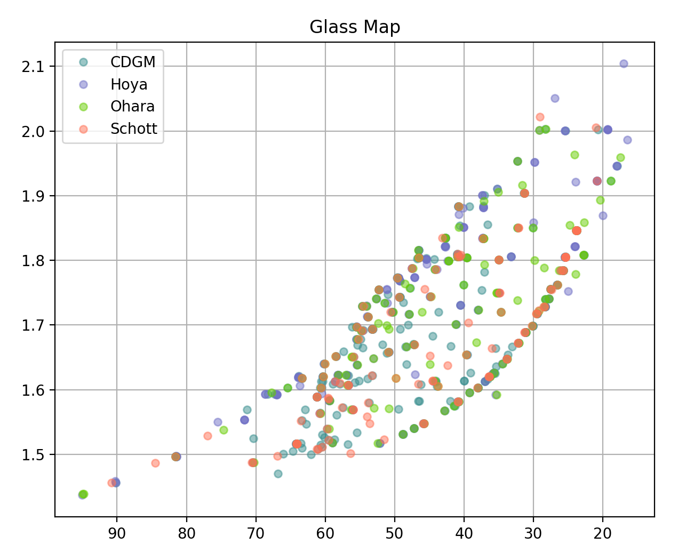

opticalglass
============

|opticalglass| provides a common API to a number of different optical material data sources. These include

- interfaces to vendor supplied Excel spreadsheets with glass data.
- ability to import material files in the Zemax .agf data format.
- ability to import material data from the |RII|_ database.

These and other sources of data are organized into libraries. Each library contains one or more catalogs, and each catalog contains one or more glasses. The glass catalog of particular vendors (e.g. Hoya, Ohara, Schott) will be found in multiple libraries. The user can control the order in which the libraries are searched, as well as the order of the catalogs available from each library.

The global variable |og_glass_libs| is an instance of the :class:`~.glassfactory.CentralGlassLibrary` class that contains the various libraries and catalogs. 

A Qt-based graphical glass map display is built on top of this capability.

.. toctree::
   :maxdepth: 2

   README <README>
   OG_Overview
   OG_Quickstart/OG_Quickstart
   OG_Pandas_intro/OG_Pandas_intro
   OG_RefractiveIndexInfo/OG_RefractiveIndexInfo

   opticalglass

.. _misc-items:

.. toctree::
   :maxdepth: 1
   :caption: Miscellaneous

   Authors <authors>
   License <license>
   Changelog <changelog>

Indices and tables
==================

* :ref:`genindex`
* :ref:`modindex`
* :ref:`search`
